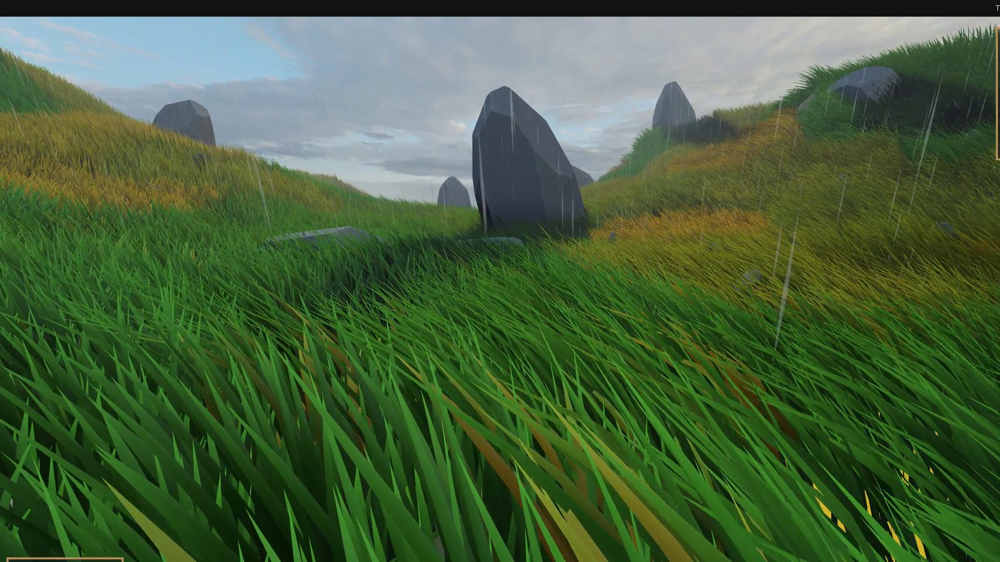

# Hex

A 3D local multiplayer co-op brawler built with Godot 4, focused on emergent cooperative gameplay in procedurally generated worlds.

**Work in Progress**

## About

Hex is a top-down brawling game for local multiplayer where teamwork is the core mechanic. The world is freshly generated each session, and the emergent chaos of co-op combat keeps gameplay unpredictable.

Core pillars:
- **Emergent Co-op** - mechanics designed around player synergy; abilities and interactions that reward coordination
- **Procedural World Generation** - multi-threaded 3D world generation ensures fast load times and varied environments every run
- **Dynamic Nav-Mesh** - navigation meshes are computed at runtime to match the generated world, keeping enemies and AI responsive
- **Local Multiplayer** - couch co-op focused, built with Godot's input handling for multiple local controllers

## 🎮 Running the Project

1. Clone the repo
2. Open `project.godot` in Godot 4
3. Connect controllers (optional — keyboard supported)
4. Hit **F5** to run

